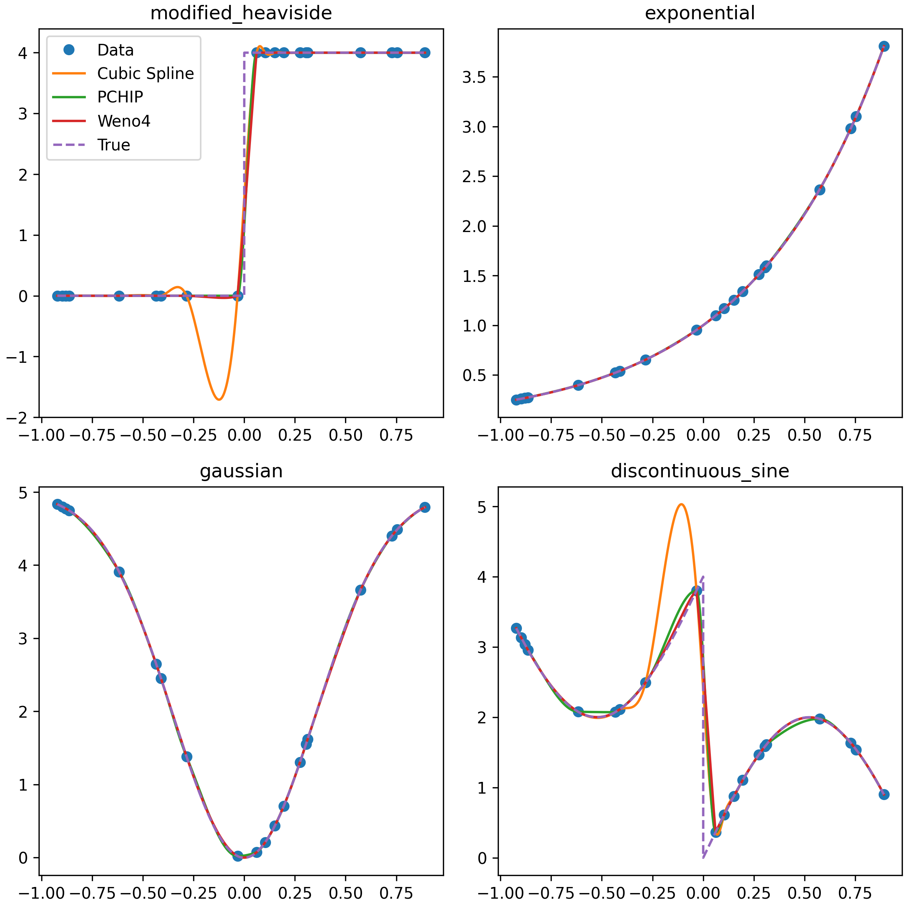

## Simple Implementation of Fourth-Order WENO Interpolation
**Chris Osborne, University of Glasgow, 2020, MIT License**

Direct implementation from the very clear method presented in [Janett et al (2019)](https://ui.adsabs.harvard.edu/abs/2019A%26A...624A.104J/abstract).
Weighted Essentially Non-Oscillatory (WENO) techniques are used to provide high order reconstructions of data, whilst remaining stable around discontinuities. Most WENO algorithms are designed for reconstructing interface values in finite difference and finite volume codes (often assuming uniform grids).
The method implemented here was designed for arbitrary interpolation on non-uniform grids.

The file `weno4.py`, provides one function `weno4`, that performs the interpolation, with optional quadratic extrapolation on the extremities (off by default).
See the docstring for more information.

Running the file `weno4.py` directly should reproduce the test cases from the paper, and should look something like this:

Note that this WENO scheme does not enforce monotonicity, and may introduce small under- or overshoots around extrema (although without "ringing"), which can possibly introduce negative values in the the interpolation of a strictly positive function (e.g. the modified Heaviside test case).

## Prerequisites

- numpy (tested on 1.18.2)
- numba (tested on 0.48 & 0.49)

If you want to run the examples:
- scipy
- matplotlib

## Installation

For now the code is a single file, with no installation scheme, but will be placed on PyPI soon.

## Reference

[Janett et al (2019). A&A 624, A104](https://ui.adsabs.harvard.edu/abs/2019A%26A...624A.104J/abstract)
